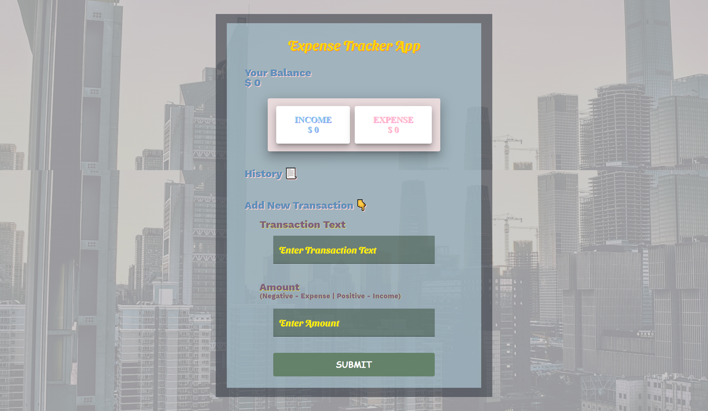

# 👨‍💻 Expense Tracker App (Progressive Web App).
## 📽 A project based on Panacloud React Bootcamp [Project 7A].

### ⚒ Project Demo:
####  For Project Demo Follow the Link: https://expensify-pwa.web.app/

### 🕵️‍♂️ Project Details:
####  This project is based on primarily on React TypeScript as well as uses other libraries too. In this app you can calculate and track your expenses with offline availability!

### ⚙ Technical Details:
#### In this project, React with TypeScript, Context API and React Hooks is used for the project. Other Libraries used includes Material-UI, TypeScript, Cuid, Firebase, ReactToastify and StyledComponent.

### 🤹‍♂️ Skill:
&nbsp;&nbsp;&nbsp;&nbsp;
&nbsp;&nbsp;&nbsp;&nbsp;
&nbsp;&nbsp;&nbsp;&nbsp;
&nbsp;&nbsp;&nbsp;&nbsp;
&nbsp;&nbsp;&nbsp;&nbsp;
&nbsp;&nbsp;&nbsp;&nbsp;

### ✔ Contributers:

  <a href="https://github.com/faraasat">
    &nbsp&nbsp&nbsp&nbsp&nbsp&nbsp&nbsp&nbsp&nbsp&nbsp&nbsp&nbsp
  </a>

### 📷 Project UI:

  <a href="https://expensify-pwa.web.app/">
    &nbsp&nbsp&nbsp&nbsp&nbsp&nbsp&nbsp&nbsp&nbsp&nbsp&nbsp&nbsp
  </a>

